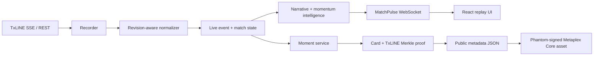

# MatchPulse

MatchPulse turns a TxODDS TxLINE score stream into a replayable live match story: score changes, narrative, momentum shifts, alerts, provenance-backed moment cards, and optional Solana devnet collectibles.

Live product: [app.ball-ai.xyz/matchpulse](https://app.ball-ai.xyz/matchpulse)

This repository is a source-only feature slice from a larger private platform. It shows the complete MatchPulse ingestion, normalization, replay, moment-card, and browser experience, but it is not a standalone deployment bundle.

## Architecture

The normalizer treats later TxLINE frames with the same event `Id` as revisions. A confirmed scoring frame remains the single score-bearing event; a later richer frame emits a non-scoring amendment. That preserves score idempotency while allowing late player attribution to update the narrative.

## Repository map

- `app/live/txline/` — auth, REST/SSE client, recording, replay, event mapping, momentum, and revision-aware normalization.
- `app/moments/` — persisted moment records, card/proof orchestration, public metadata, and mint receipts.
- `frontend/src/` — the flag-gated MatchPulse page, WebSocket hook, replay controls, narrative UI, and Phantom mint action.
- `docs/plans/` — the three delivery phases in public, provider-only terms.
- `TECHNICAL.md` — endpoint inventory and implementation decisions.

## Data policy

No full match recording is included. The two committed JSONL files are small, purpose-limited test excerpts. The four-frame revision fixture demonstrates an unconfirmed penalty, confirmation, and late player attribution while retaining the real `Seq` values required by the proof flow.

## Verification highlights

- Reconnectable SSE parsing and JSONL replay.
- Stat-major score keys and real frame sequence numbers for proof requests.
- `StatusId` drives match state; the observed string `GameState` is preserved as source data.
- Same-event revisions can enrich the story without incrementing the score twice.
- Proof or card generation can fail independently without failing moment creation.
- Phantom signs in the browser; no mint authority is held by the backend.

See [TECHNICAL.md](TECHNICAL.md) for request shapes and the mint sequence.
