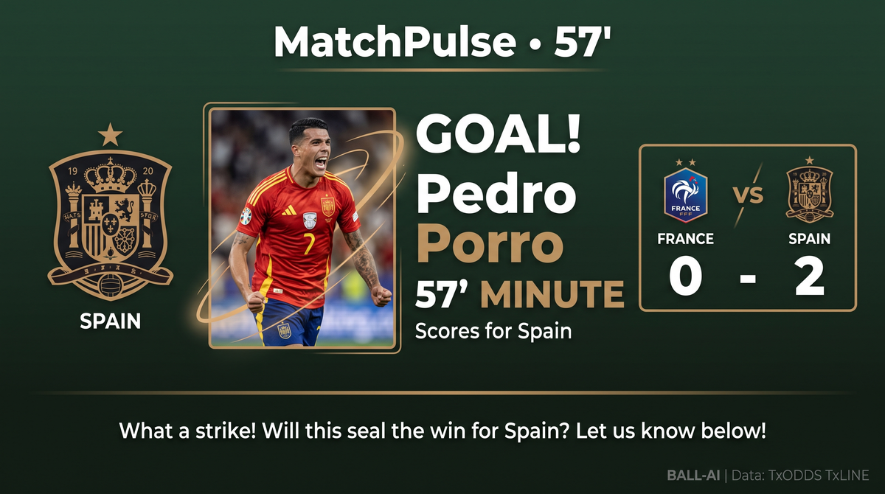
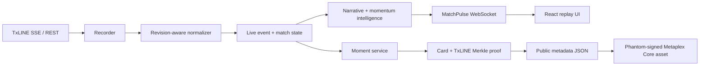
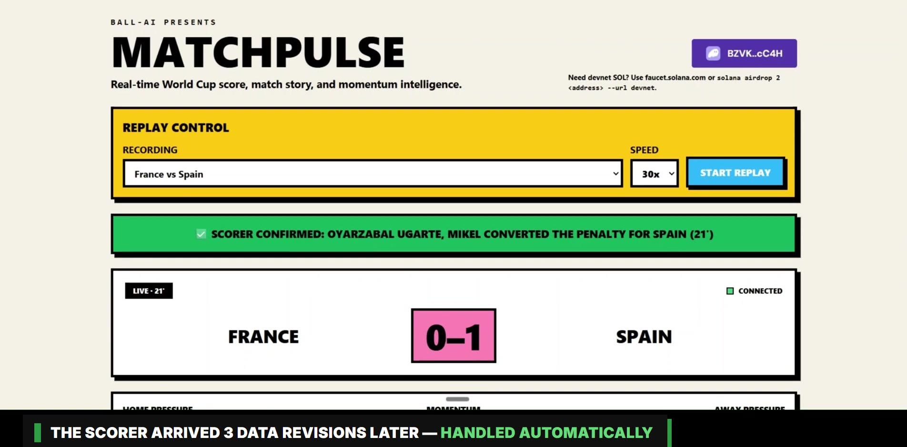

# MatchPulse

**Live World Cup score intelligence with provably-real on-chain moments.** MatchPulse turns the TxODDS TxLINE score stream into a replayable live match story — score, narrative, momentum shifts, alerts — and lets fans mint the moments that matter as Metaplex Core NFTs on Solana whose metadata embeds a TxLINE Merkle multiproof of the underlying stat.

**▶ [Demo video (3½ min)](https://youtu.be/lnO93lOjObA)** · **[Live app](https://app.ball-ai.xyz/matchpulse)** · **[Technical deep dive](TECHNICAL.md)**

Built for the **TxODDS × Solana World Cup Hackathon** (Consumer & Fan Experiences track). The recordings that drive the app's replays were captured live during both real World Cup semifinals, the nights they happened.

## A real moment, verifiable end-to-end

Every link in the chain below is live, from the semifinal (France 0–2 Spain, July 14):

| Step | Pedro Porro, 57' goal | Oyarzabal scorer confirmation, 21' |
|---|---|---|
| Public metadata (`Verified: true`, real TxLINE `Seq`) | [metadata](https://api.ball-ai.xyz/api/moments/9463dd5b-3071-4a92-8267-908e1fba77bd/metadata) · seq 620 | [metadata](https://api.ball-ai.xyz/api/moments/fcf5af82-cf93-4af3-bf5d-51c225a4e468/metadata) · seq 222 |
| On-chain asset (Metaplex Core, devnet) | [explorer](https://core.metaplex.com/explorer/GWNWkcwRYWzLDTY69tY4teD9zcLbpnJ2K7VDSUpM1H6F?env=devnet) | [explorer](https://core.metaplex.com/explorer/5nLDnDrkAhqHn9WMJz79toPYsbnpJJKyW57PPi6DmoCb?env=devnet) |

The asset's `uri` points at the metadata endpoint, so the TxLINE Merkle multiproof — bound to the exact stream sequence the event arrived on — is reachable directly from the on-chain account. The 21' moment is an *amendment*: TxLINE delivered the scorer three data revisions after the goal, and the revision ledger attributed it without ever double-counting the score.

## Architecture

The normalizer treats later TxLINE frames with the same event `Id` as revisions of one logical record. The first attributed confirmed frame remains the single score-bearing event; a later richer frame emits a non-scoring amendment that references it. That preserves score idempotency while allowing late player attribution — a routine reality of live data — to update the narrative instead of corrupting the score. Full semantics in [TECHNICAL.md §2](TECHNICAL.md#2-normalization-and-the-revision-ledger).

## Repository map

- `app/live/txline/` — auth, REST/SSE client, recording, replay, event mapping, momentum, and revision-aware normalization — with tests and real recorded revision fixtures.
- `app/moments/` — persisted moment records, card/proof orchestration, public metadata, mint receipts, and the database migration.
- `frontend/src/` — the flag-gated MatchPulse page, WebSocket hook, replay controls, narrative UI, and Phantom mint action.
- `docs/plans/` — the three delivery phases in public, provider-only terms.
- [`TECHNICAL.md`](TECHNICAL.md) — TxLINE endpoint inventory, revision-ledger semantics, the Merkle proof pipeline, the mint sequence, and the recording/replay engine.

This repository is a **source-only feature slice** from a larger private platform. It shows the complete MatchPulse ingestion, normalization, replay, moment, and browser experience, but it is not a standalone deployment bundle.

## Data policy

No full match recording is included. The two committed JSONL files are small, purpose-limited test excerpts. The four-frame revision fixture demonstrates an unconfirmed penalty, its confirmation, and late player attribution while retaining the real `Seq` values required by the proof flow.

## Verification highlights

- Resumable SSE with `Last-Event-ID`, exponential-backoff reconnects, and identical JSONL replay through the same normalizer.
- Proof requests use stat-major score keys and the frame's **real** provider sequence — never a fabricated one.
- `StatusId` drives match state; the observed `GameState` string is preserved as source data, not rewritten.
- Same-event revisions enrich the story without incrementing the score twice; amendments carry their own provenance.
- Proof and card generation fail independently and explicitly — a degraded moment beats a match-time HTTP error.
- Phantom signs in the browser; the backend holds no mint authority. Moment creation is idempotent per event; mint receipts are last-write-wins by design.

## License

[MIT](LICENSE) © 2026 Ball-AI · Match data: TxODDS TxLINE
