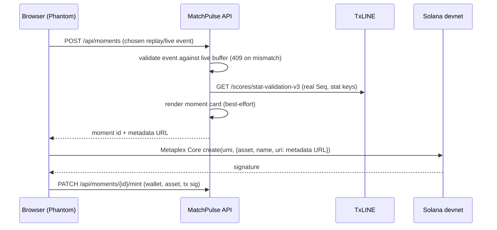

# MatchPulse — technical notes

MatchPulse turns the TxODDS TxLINE live score feed into a real-time match intelligence UI and lets fans mint the moments that matter — goals, penalties, scorer confirmations — as Metaplex Core NFTs on Solana whose metadata embeds a TxLINE Merkle multiproof of the underlying stat.

This document covers the TxLINE integration, the revision-aware event model, the proof and mint pipeline, the recording/replay engine, and the live intelligence layer. See `README.md` for the architecture overview and repo layout.

---

## 1. TxLINE integration

### Credentials

Guest access is bootstrapped once, manually: `POST /auth/guest/start` yields a guest JWT and `POST /api/token/activate` activates the subscription on the chosen network. The resulting values are supplied to the app as configuration (`TXLINE_GUEST_JWT`, `TXLINE_API_TOKEN`) — the runtime never calls the auth endpoints itself. Every request carries both `Authorization: Bearer <jwt>` and `X-Api-Token` headers (`app/live/txline/auth.py`). HTTP 401 and 403 map to typed exceptions that distinguish "guest session expired" from "token activated on a different network".

### Runtime operations

The API host is operator-configured via `TXLINE_API_BASE_URL` (TxLINE publishes a mainnet host, `https://txline.txodds.com/api`, and a devnet host, `https://txline-dev.txodds.com/api`). The client (`app/live/txline/client.py`) invokes six operations, all `GET`:

| Path | Purpose | Notes |
|---|---|---|
| `/fixtures/snapshot` | Discover fixtures and participant metadata | `competitionId`, `startEpochDay` filters |
| `/scores/stream` | Live score frames over SSE | optional `fixtureId` filter, resumable cursor |
| `/scores/snapshot/{fixtureId}` | Score snapshot | optional `asOf` timestamp |
| `/scores/updates/{fixtureId}` | Recover score updates for a fixture | |
| `/scores/historical/{fixtureId}` | Historical frames for replay | 6-hour to 2-week window |
| `/scores/stat-validation-v3` | Merkle multiproof for selected fixture stats | `fixtureId`, `seq`, `statKeys` |

### SSE client behavior

- Sends `Accept: text/event-stream` and `Cache-Control: no-cache` on top of the two auth headers.
- Parses `id:` / `event:` / multiline `data:` fields; `data` lines are accumulated, joined, and JSON-decoded with a raw-string fallback. `heartbeat` frames are skipped.
- The stream loop is an infinite retry (tenacity, exponential backoff 2 → 30 s) around connect/read/protocol failures. The read timeout is disabled so a quiet match never idle-times-out the stream.
- Every frame's SSE `id` is tracked and re-sent as `Last-Event-ID` on reconnect, so a dropped connection **resumes** instead of restarting.
- The REST helpers tolerate TxLINE occasionally answering `text/event-stream` where the OpenAPI schema promises a JSON array — the payload is decoded through the same SSE-frame parser.

### Live lineup priming

`/scores/stream` never carries `Lineups`, so a purely live subscription would resolve every player and team to a raw integer id. On subscribe, the client first pulls `/scores/snapshot/{fixtureId}` (falling back to `/scores/updates`) and primes the normalizer's name maps from any lineup frames found. Priming ingests **names only** — deliberately not clock or period — so a stale snapshot can never backdate the match clock or re-fire past goals. Priming is best-effort: if it fails, the stream still starts.

---

## 2. Normalization and the revision ledger

TxLINE delivers each real-world incident as a series of confirmed revisions of one logical record — a goal may arrive first anonymously, then again with the scorer attributed. MatchPulse treats this as a feature and models it explicitly (`app/live/txline/normalizer.py`):

- **Identity.** Each event is keyed by `(fixture, action, provider Id)`, falling back to `Seq` when `Id` is absent. The canonical event id is `txline:{match}:{action}:{id}`.
- **Unconfirmed frames are dropped.** Only `Confirmed` revisions enter the pipeline.
- **Anonymous goal/card revisions are held back.** For goals and cards, a confirmed revision with no `PlayerId` is suppressed — the first *attributed* revision becomes the canonical scoring event. This prevents duplicate and anonymous alerts. Penalties are not held back: a confirmed penalty emits immediately and gains its scorer later.
- **A revision ledger decides what re-emits.** Every emitted event snapshots its attribution (player id/name, team id/name, outcome, sequence). A later same-identity revision emits only if it *enriches* that snapshot — adds or corrects a player, team, or outcome. Exact repeats and poorer revisions are silently absorbed.
- **Amendments are explicitly non-scoring.** An enriching revision emits an `Event Amendment` carrying `amends_event_id` (the canonical event), the amended outcome, and the provider `Seq` of the amending frame. Amendments never touch the score or momentum; downstream they render as "SCORER CONFIRMED" style notifications. A revision without a `Seq` is skipped rather than amended — provenance is required.
- **`StatusId` is authoritative for match phase.** The source `GameState` value is used only as a fallback and is retained, never rewritten. Phase transitions (half start/end, extra time, penalties, fulltime) are synthesized from status changes and deduplicated.
- **`Seq` becomes `event_index`** on every frame and later feeds proof generation — the provider's sequence number is preserved end-to-end, never fabricated.

Real revision traces from France–Spain (fixture `18237038`) are shipped as test fixtures, including the unconfirmed-penalty → confirmation → late-scorer-attribution sequence.

---

## 3. Verifiable moments: the Merkle proof pipeline

`/scores/stat-validation-v3` returns a Merkle multiproof binding selected stat values to a specific stream sequence. MatchPulse embeds that proof in the NFT metadata:

- **Stat keys are stat-major.** Base keys `1/2` are participant-one/two goals, `3/4` yellow cards, `5/6` red cards, `7/8` corners. Period prefixes scope a key to a match phase: `1000` first half, `3000` second half, `4000`/`5000` extra time, `6000` penalty shootout; unprefixed keys are full-match totals. MatchPulse derives the key set from the moment's event type and period (goal → the scoring participant's goal count, card → the carded participant's card count, and so on).
- **Real sequences only.** A proof is requested exclusively with the frame's real provider `Seq` (`seq >= 1` is enforced at the client; a moment whose event lacks a sequence simply gets no proof). One to five comma-separated keys per request.
- **Proof storage.** The multiproof response is stored verbatim as compact, key-sorted JSON on the moment row.
- **Metadata surface.** `GET /api/moments/{id}/metadata` returns Metaplex-standard off-chain JSON whose attributes include `Match ID`, `Minute`, `Event Type`, `Verified` (`"true"`/`"false"` — keyed on proof presence), and, when verified, `TxLINE Sequence` and the serialized `TxLINE Proof` itself. Because the mint's `uri` points at this endpoint, the proof is reachable directly from the on-chain asset.

---

## 4. Moment creation and mint flow



1. The browser posts the chosen event to `POST /api/moments`. The API requires the event to still exist in the live/replay processor buffer and validates its identity — a stale or forged event id gets a `409`, not a moment.
2. Creation is **idempotent per event**: a unique `(match_id, event_id)` index plus an `IntegrityError` race handler means replaying a match and re-minting the same goal returns the existing moment instead of duplicating it.
3. The service persists the event and match snapshot, requests the TxLINE proof with the frame's real `Seq`, and attempts a moment-card render. Proof and card are each **best-effort by design**: a temporary external failure yields a usable persisted moment with an explicit unverified or image-fallback state (an inline placeholder SVG) rather than a match-time HTTP failure. Card images are capped at 1200 px so NFT preview proxies accept them.
4. The MatchPulse page creates a Umi client on Solana devnet (RPC configurable via `VITE_SOLANA_RPC_URL`) and bridges the connected Phantom wallet. **The backend holds no mint authority** — the fan's wallet signs.
5. Metaplex Core `create(umi, { asset, name, uri })` creates the asset; the moment's metadata endpoint is its `uri`.
6. The browser patches the wallet address, asset address, and transaction signature to `PATCH /api/moments/{id}/mint`. Mint receipts are **last-write-wins**: re-minting an existing moment with a new wallet is a designed path, and the receipt simply follows the latest successful mint.

---

## 5. Recording and replay

Live sessions are captured as JSONL with a four-key envelope per line:

```json
{"received_at": "...", "sse_id": "...", "sse_event": "...", "data": { }}
```

- `received_at` is wall-clock reception time, `sse_id`/`sse_event` are the SSE metadata, and `data` is the untouched TxLINE frame. The recorder appends and flushes per frame, so a crash mid-match loses at most the in-flight line.
- A REST-recovery path converts `/scores/updates` and `/scores/historical` responses into the **same envelope shape** (deriving `received_at` from the frame's epoch-ms `Ts`), so recordings from either source replay identically.
- Replay (`app/live/txline/replay.py`) re-normalizes envelopes through the very same `TxLineNormalizer` as live traffic — downstream processing cannot tell the difference. Inter-event delays are scaled by the chosen speed (1–60×) and capped at 5 s so half-time never stalls a demo.
- Recording file resolution is path-guarded against traversal; team labels for the picker come from a `.meta.json` sidecar or in-band lineup frames. Live SSE captures (which carry no lineups in-band) are hidden from the picker rather than shown with raw ids.

---

## 6. Live intelligence

- **Momentum.** A sliding 10-minute window of weighted events (goal/shot 3.0 … corner 0.8; a red card counts −2.0 *against* the offending side) produces a home-minus-away delta normalized to [−1, 1]. A momentum-shift alert fires only on a **threshold-crossing sign flip** (|delta| ≥ 0.45 with at least 3 contributing events) — this is deliberately a location-free pressure proxy, since TxLINE frames carry no coordinates. Amendments never contribute.
- **WebSocket protocol.** `WS /api/matchpulse/ws/{match_id}` sends a `state_snapshot` (score, phase, momentum delta) on connect and every second, plus a `live_update` envelope per notification (goal, penalty, VAR, amendment, momentum shift, fulltime). The frontend reconnects after 3 s, closes hidden tabs after 60 s, and restores the active match across reloads.

---

## 7. HTTP surface

| Method | Path | Purpose |
|---|---|---|
| `POST` | `/api/moments` | Create a moment from a buffered live/replay event |
| `GET` | `/api/moments` | List moments (newest first; `match_id`, `limit` filters) |
| `GET` | `/api/moments/{id}` | Fetch one moment |
| `PATCH` | `/api/moments/{id}/mint` | Record a mint receipt (last-write-wins) |
| `GET` | `/api/moments/{id}/metadata` | Public Metaplex off-chain JSON (proof attributes) |
| `GET` | `/api/matchpulse/health` | Feature flag + recordings count |
| `GET` | `/api/matchpulse/recordings` | Recordings for the picker (labeled, filtered) |
| `POST` | `/api/matchpulse/replay` | Start a replay session |
| `GET` | `/api/matchpulse/replay/{match_id}` | Replay session status |
| `DELETE` | `/api/matchpulse/replay/{match_id}` | Stop a replay session |
| `WS` | `/api/matchpulse/ws/{match_id}` | Live state snapshots + notifications |

---

## 8. Runtime and scope

- The feature is flag-gated end to end: `MATCHPULSE_ENABLED` mounts the routers, `TXLINE_ENABLED` gates the provider, and the frontend checks `VITE_MATCHPULSE_ENABLED`.
- Persistence is a single `match_moments` table (UUID primary key, unique `(match_id, event_id)`, public-read RLS) — migration included under `app/moments/`.
- This repository is a **source-only feature slice** of the Ball-AI platform: it contains the TxLINE provider module, the moments service, and the MatchPulse frontend, each with their tests and real recorded revision fixtures. The live orchestration layer that hosts them in production (subscription manager, notification fan-out, tactical-shift detection, AI card rendering) lives in the parent monorepo and is not included, so this slice is meant to be read, not deployed. No full match recordings are committed — only minimal fixtures.
